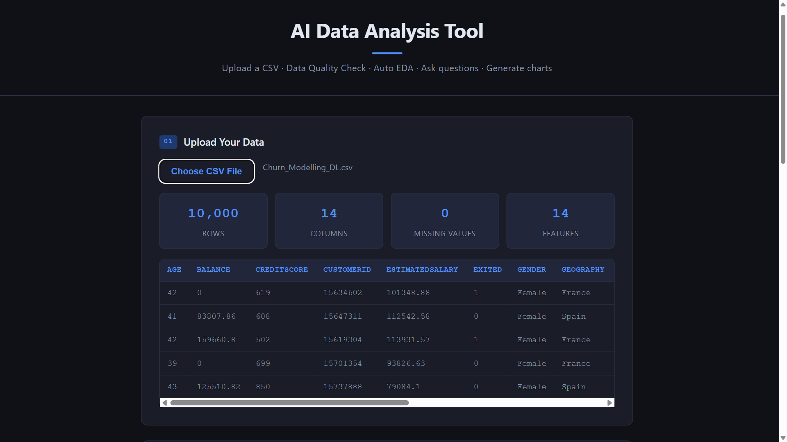
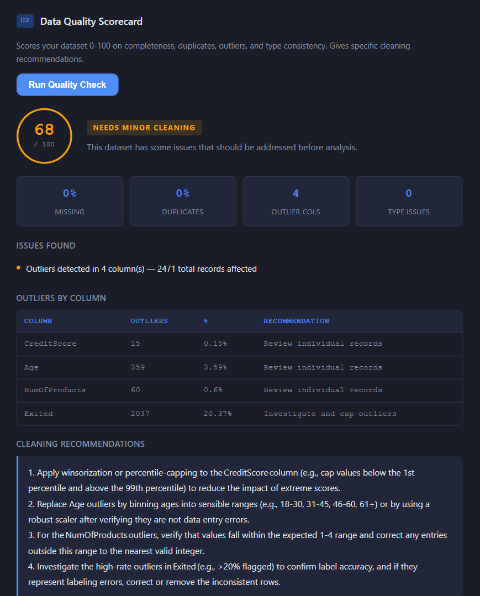
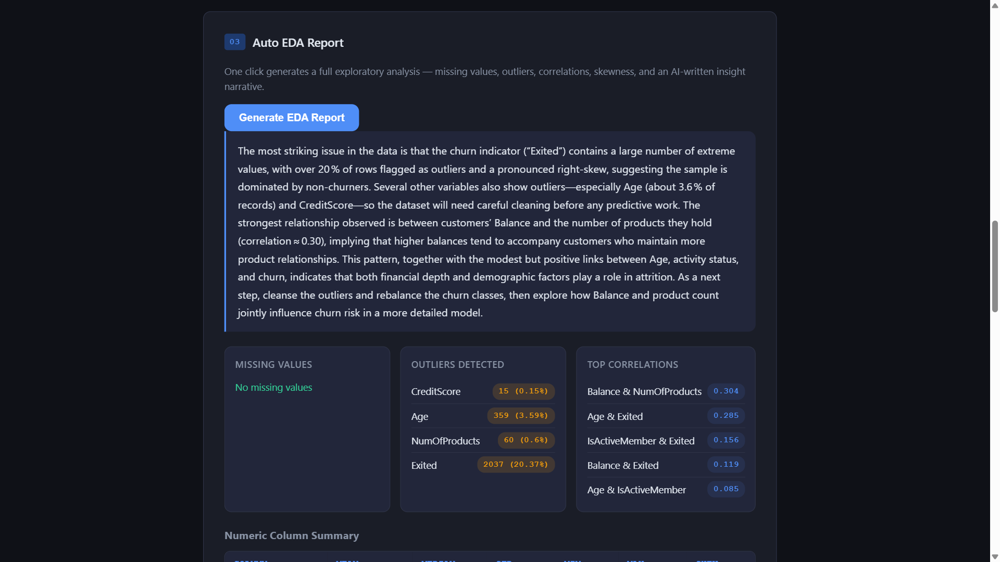
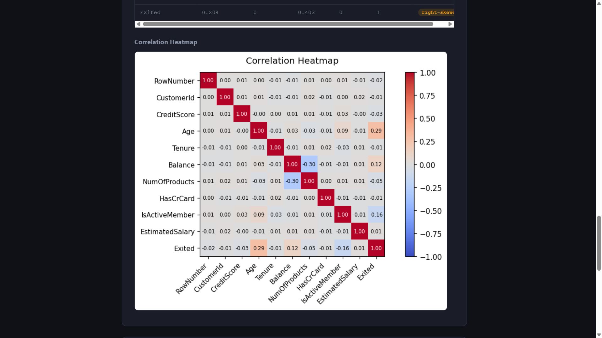
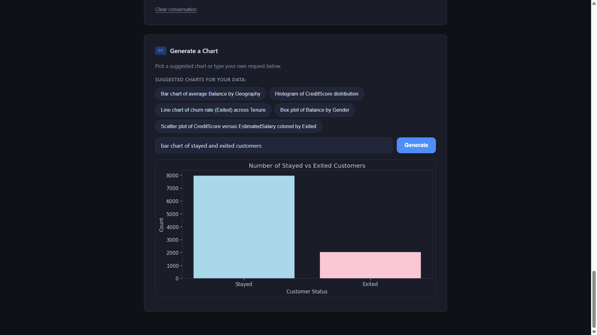

# AI-Powered CSV Data Analysis Web App

EDA in Jupyter gets old fast. This app does the grunt work — data quality
check, exploratory analysis, AI-powered Q&A, and chart generation — upload
a CSV and everything runs in the browser.

## Demo


https://github.com/user-attachments/assets/ead61987-8d97-4b0c-b133-5c2a370811a8


---

## Screenshots

**Upload & Dataset Summary**


**Data Quality Scorecard**


**Auto EDA Report**



**Chart Generator**


---

## What it does

**Data Quality Check**
Scores your dataset from 0 to 100. Catches missing values, duplicate rows,
outliers by column, and type mismatches. Tells you what to fix and how.

**Auto EDA**
One click. You get a written summary of the key findings, a correlation
heatmap, skewness flags, and a full numeric column breakdown. Takes about
15 seconds.

**Ask Your Data**
Type a question in plain English — "what is the average balance of customers
who churned?" — and get a direct answer based on your actual data, not
generic advice.

**Chart Generator**
Describe what you want. The app writes the code and renders the chart.
Download it as a PNG.

---

## Stack

Python, Flask, Pandas, NumPy, Matplotlib, Groq API, plain HTML/CSS/JS.

---

## Run it locally

```bash
git clone https://github.com/Tisha34/AI-Powered-CSV-Data-Analysis-Web-App.git
cd AI-Powered-CSV-Data-Analysis-Web-App
pip install -r requirements.txt
```

Create a `.env` file with your Groq API key:

```
GROQ_API_KEY=your_key_here
```

Free key at https://console.groq.com

Then:

```bash
python app.py
```

Open `http://127.0.0.1:5000` and upload any CSV.

---

## Tested with

The Churn Modelling dataset (10,000 rows, 14 columns). Works with any
well-structured CSV — sales data, HR data, finance data, whatever you have.

---

Tisha Gandhi — [LinkedIn](https://linkedin.com/in/tisha-gandhi) · [GitHub](https://github.com/Tisha34)
